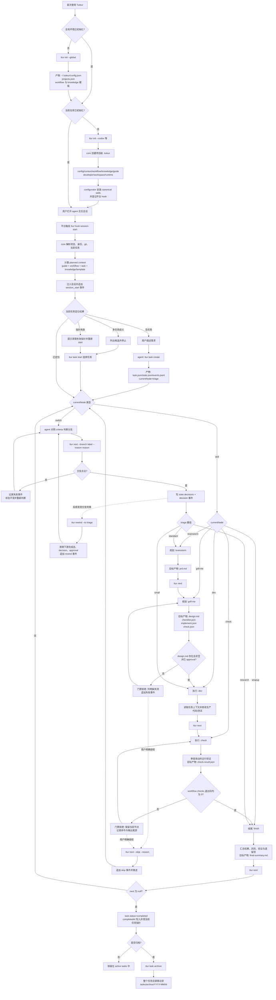

# Harness 全流程与阶段产物

> 本文回答「Tuteur 从项目初始化、会话开始、任务对话到流程结束如何串起来，以及每个阶段留下什么产物」。
> 规则与 schema 仍以 [core.md](./core.md)、[harness.md](./harness.md)、[cli.md](./cli.md) 和 [knowledge.md](./knowledge.md) 为准；本文只做跨域串联，不另立协议。

---

## 1. 核心分工

```text
用户                 说明目标、回答问题、审批、授权跳过
agent                执行当前 skill，产出文档/代码/验证结果，报告分支判断
ttur CLI / hook      统一事件入口，参数解析后调用 core
@tuteur/core         唯一事实与判定层：读写状态、计算上下文、校验门禁、推进 workflow
workflow             声明当前要做哪一步、需要哪些产物和检查
skill                说明这一步怎么做
artifact template    说明这一步的产物长什么样
web                  展示和编辑，不复制 core 的判定逻辑
```

最重要的不变量：**agent 自称完成不等于节点完成；只有 `@tuteur/core` 的门禁通过后，workflow 才推进。**

---

## 2. 端到端流程图



这张图表达三条并行链路：

1. **控制链**：`state.currentNode` → `ttur next` → core 门禁 → 下一节点。
2. **内容链**：knowledge/template/context → session-start 注入 → skill 执行 → task artifact。
3. **审计链**：每次会话、推进、分支、失败、审批、跳过、回退 → `events.jsonl`。

---

## 3. 阶段与产物

### 3.1 初始化产物

| 阶段 | 产物 | 性质 | 消费方 |
| --- | --- | --- | --- |
| 全局初始化 | `~/.tuteur/config.json`、`projects.json`、`workflows/`、`knowledge/` | 本机个人配置与跨项目模板，不保存任务 | CLI、web、新项目初始化 |
| 项目初始化 | `.tuteur/config.json`、`guide.md`、`context.json`、`workflows/*.workflow.json` | 项目共享 harness 配置 | core、hook、web |
| 项目初始化 | `.tuteur/knowledge/{sources,wiki,index.md,log.md}` | 项目知识与产物模板库 | hook、skill、web |
| 身份初始化 | `.tuteur/.developer`、`workspace/<slug>/index.md` | 本地身份 + 共享成员名册 | task create/list、web |
| agent 适配 | agent 原生 skill 目录、hook 声明、`template-hashes.json` | 平台接入与模板升级保护 | agent、`ttur update` |

### 3.2 会话与任务运行产物

| 时机 | 产物 | 写入者 | 作用 |
| --- | --- | --- | --- |
| 创建任务 | `task.json` | core | 任务元数据、workflow、负责人、状态 |
| 创建/推进任务 | `state.json` | core | 当前节点、已完成节点、分支判断、审批快照 |
| 会话开始 | `events.jsonl: session_start` | hook/core | 实际注入清单，用于 planned/actual 对比 |
| 任意推进尝试 | `events.jsonl: complete_attempt` | core | 成败、阻塞原因、重试告警数据源 |
| 分支/审批/跳过/回退 | `events.jsonl` 对应事件 | core | 完整审计轨迹 |
| 选择当前任务 | `runtime/current-task.json` | core | 本机会话缺省任务指针，不提交 git |

### 3.3 默认 workflow 业务产物

| 路径/节点 | 输入 | 目标产物 | 当前硬门禁 | 建议模板 id |
| --- | --- | --- | --- | --- |
| `triage` | 用户需求、任务元数据、分支 criteria | `state.decisions.triage` + `decision` 事件 | 合法 branch label | 无独立文件模板 |
| `brainstorm` | 原始需求、项目知识 | `prd.md` | **当前无 artifact gate** | `prd-template` |
| `grill-me` | `prd.md`、用户澄清、项目规范 | `design.md`、`checklist.json`、`implement.json`、`check.json` | **当前仅 `design.md` + approval** | `design-template`、`checklist-template`、`context-manifest-template` |
| `dev` | 规划产物、上下文清单、代码库 | 生产代码、测试代码、必要迁移/文档 | **当前无 artifact/check gate** | 通常不需要文档模板 |
| `check` | git diff、设计与验收清单、测试命令 | `check-result.json` | **当前仅 `npm test`** | `check-result-template` 或 JSON schema |
| `wrapup/finish` | 全部产物、验证结果、已知风险 | `final-summary.md` | **当前无 artifact gate** | `final-summary-template` |

上表的“目标产物”来自现有 skill 占位文本和设计文档；除明确标注的当前硬门禁外，其他产物还没有被 workflow 强制要求。

---

## 4. Skill、模板与门禁如何衔接

每个节点应保持三层职责分离：

```text
SKILL.md
  规定过程：读什么、问什么、怎么判断、怎么验证、何时停止

knowledge/wiki/<template-id>.md (kind: template, inject: full)
  规定格式：产物章节、字段、必填项、示例和禁止事项

workflow gate.artifacts/checks/approval
  规定完成条件：哪些路径必须非空、哪些命令必须成功、是否需要审批
```

推荐的节点声明形态：

```jsonc
{
  "id": "brainstorm",
  "type": "skill",
  "skill": "brainstorm",
  "phase": "planning",
  "next": "grill-me",
  "gate": {
    "artifacts": [
      { "path": "prd.md", "title": "需求说明", "template": "prd-template" }
    ]
  }
}
```

门禁仍只检查 `path` 存在且非空；模板负责结构，skill 负责内容质量，必要时由 `checks` 或 `approval` 补足内容验收。

---

## 5. 异常、拦截与恢复

| 场景 | 系统行为 | 状态变化 | 恢复动作 |
| --- | --- | --- | --- |
| 未初始化项目 | 不进入任务流程 | 无 | `ttur init` |
| 无当前任务 | 注入 NO ACTIVE TASK | 无 | agent 创建任务 |
| 多个未完成任务 | 报 AMBIGUOUS，不猜 | 无 | `ttur task start <id>` |
| switch 未给/给错 branch | exit 2，列合法分支 | 不变 | 重新判断并提交合法 branch |
| artifact 缺失或为空 | exit 2，列路径 | 不变 | 补齐产物后重试 `ttur next` |
| check 失败 | exit 2，返回失败命令与输出尾部 | 不变 | 修复后重跑验证与 `ttur next` |
| 缺 approval | exit 2 | 不变 | 用户确认后 `ttur approve`，再 next |
| 连续失败超过阈值 | web 标记卡住 | 不自动放行 | 正常修复，或用户授权 skip |
| 门禁配置错误/flaky | 默认仍拒绝 | 不变 | 用户授权 `--skip --reason`，留痕推进 |
| switch 判错且已前进 | 不靠 workflow 回边 | 显式回退 | `ttur rewind --to <switch>` |
| workflow 完成 | `currentNode=null`、状态 completed | 完成 | 可继续保留或 archive |

---

## 6. 当前缺口与建议落地顺序

当前核心状态机已经能承载流程，但“产物规范化”还没有闭环：

1. 内置 `brainstorm/grill-me/dev/check/finish/knowledge` 的 `SKILL.md` 仍是 TODO。
2. 默认 workflow 只门禁 `design.md` 和 `npm test`，与 skill 占位中声明的产物集合不一致。
3. `ArtifactSpec.template` 和 `kind:template` 已有 schema/设计，但默认产物模板条目尚未落地并接入 workflow。
4. `checklist.json` 有 zod 与 CLI 支持；`implement.json`、`check.json`、`check-result.json` 的正式 schema/职责边界仍需确定。
5. research 分支直接进入 `finish`，但缺少独立调研产物定义；如果希望结果可复用，应明确 `research.md` 或统一由 `final-summary.md` 承载。

建议按以下顺序完成，避免 skill、模板和 workflow 三处反复改名：

```text
1. 冻结产物目录与 schema
   验证: 每个节点都有唯一的输入/输出/所有者/消费者定义

2. 编写 kind:template 条目
   验证: knowledge lint/index 通过，模板可由 id 解析并全文注入

3. 编写五个 workflow SKILL.md
   验证: 每个 skill 明确前置读取、产出、停止条件、next/approval/skip 协议

4. 用 ArtifactSpec 对象升级默认 workflow
   验证: workflow validate 无悬空 skill/template 引用

5. 跑 standard/small/research 三条端到端样例
   验证: 正常、门禁失败、approval、skip、rewind、完成与归档路径均有事件记录
```
